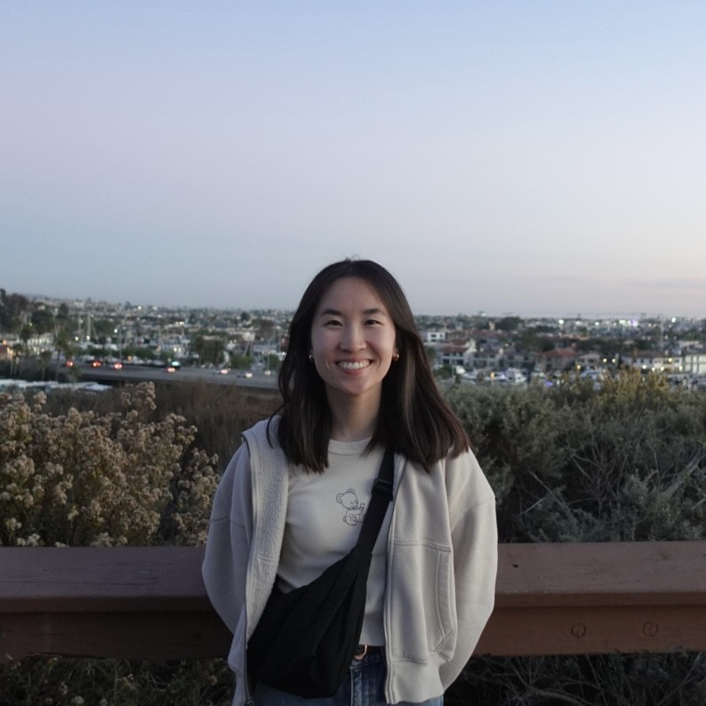

# ashley ho
## about 👋

<!-- 

  
  

    
 

    
<strong>Hi, I'm Ashley!</strong>

    
I'm a first-year graduate student pursuing a Master's degree in Data Science at UC San Diego. With a background in probability and statistics, I've developed a passion for the intersection of theory and real-world data applications. In addition to my academic pursuits, I work as a Graduate Teaching Assistant, helping students navigate data science concepts, and I’m actively involved in research focused on neural networks and machine learning. My goal is to combine my technical expertise with a strong foundation in mathematics to contribute to data-driven innovations.

  

 -->

  <!-- Left Column: Image and Links -->
  

    
    

      <a href="https://github.com/a1ho" target="_blank" style="text-decoration: none; color: #5b9bd5; font-size: 14px">GitHub</a>
      <a href="https://linkedin.com/in/yourusername" target="_blank" style="text-decoration: none; color: #5b9bd5; font-size: 14px">LinkedIn</a>
      <a href="mailto:a1ho@ucsd.edu" target="_blank" style="text-decoration: none; color: #5b9bd5; font-size: 14px;">Email</a>
    

  

  <!-- Right Column: Text -->
  

    
<strong>Hi, I'm Ashley!</strong>

    
I'm a first-year graduate student pursuing a Master's degree in Data Science at UC San Diego. With a background in probability and statistics, I've developed a passion for the intersection of theory and real-world data applications. In addition to my academic pursuits, I work as a Graduate Teaching Assistant, helping students navigate data science concepts, and I’m actively involved in research focused on neural networks and machine learning. My goal is to combine my technical expertise with a strong foundation in mathematics to contribute to data-driven innovations.

  

## education 🧮
coming soon!

## projects 💻
coming soon!