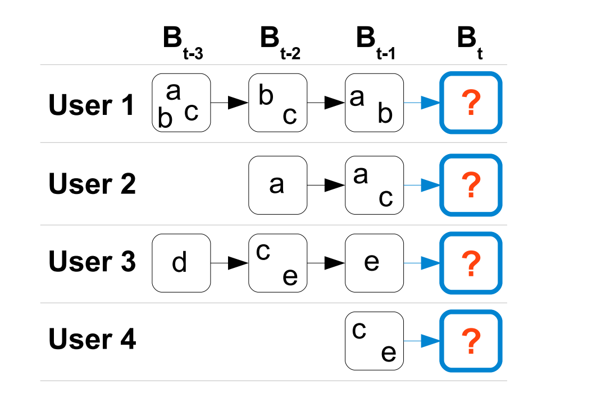
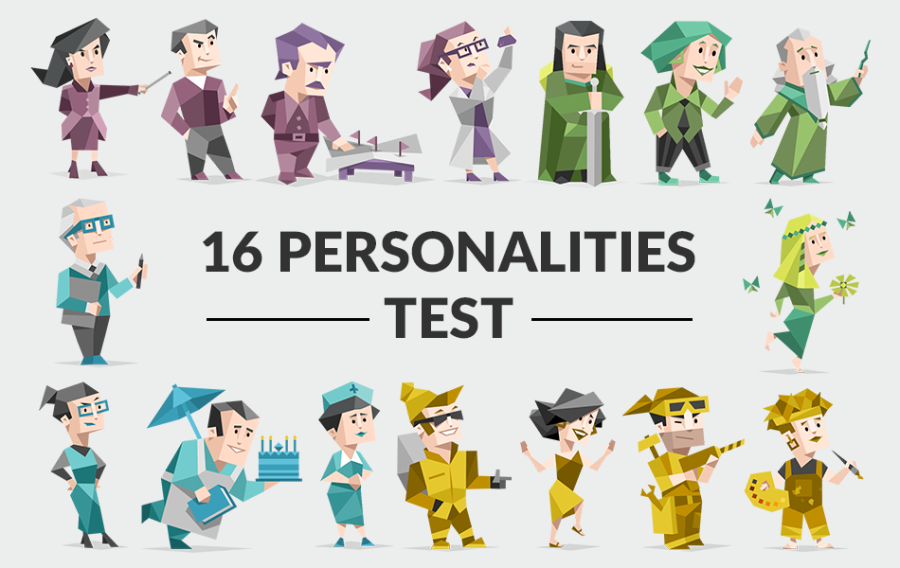

# ashley ho
<!-- ## about 👋 -->
<h2 style="font-size: 28px; margin-top: 40px;">about 👋</h2>

  <!-- left col: image and links -->
  

    
    

    <a class="about-link" href="https://github.com/a1ho" target="_blank">GitHub</a>
    <a class="about-link" href="https://www.linkedin.com/in/ashley-ho-1537aa251/" target="_blank">LinkedIn</a>
    <a class="about-link" href="mailto:a1ho@ucsd.edu" target="_blank">Email</a>
    

  

  <!-- right col: text -->
  

    
<strong>Hi, I'm Ashley!</strong>

    
I'm a first-year graduate student pursuing a Master's degree in Data Science at UC San Diego. With a background in probability and statistics, I've developed a passion for the intersection of theory and real-world data applications. In addition to my academic pursuits, I work as a Graduate Teaching Assistant, helping students navigate data science concepts, and I’m actively involved in research focused on neural networks and optimal transport mapping. My goal is to combine my technical expertise with a strong foundation in mathematics to contribute to data-driven innovations.

  

<!-- ## education 🧮 -->
<h2 style="font-size: 28px; margin-top: 50px;">education 🧮</h2>

  
University of California, San Diego

  
  

    

        

        
M.S. Data Science 2024-2025

    

    

        

        
GPA: 4.0

    

    

        

        
B.S. Probability & Statistics 2020-2024

    

    

        

        
Minor in Data Science

    

    

        

        
GPA: 3.94; Cum Laude

    

    

<!-- ## projects 💻 -->
<h2 style="font-size: 28px; margin-top: 50px;">projects 💻</h2>

    <a href="https://github.com/mf02511/Recommender_System_Algorithms" target="_blank">
        

            
            

                
Recommender System Algorithms

                

                    Compared two sequential recommendation algorithms, FPMC and SASRec. FPMC is a traditional approach rooted in linear algebra, utilizing personalized Markov chains to model sequential behaviors. SASRec is a modern state-of-the-art deep learning algorithm that utilizes self-attention mechanisms to capture intricate sequential patterns.
                

            

        

    </a>

    <a href="https://github.com/a1ho/2048_Reinforcement_Learning" target="_blank">
        

            
            

                
2048 Reinforcement Learning

                

                    Used reinforcement learning to attempt to solve 2048, a single-player tile puzzle game with the main objective of producing a large value tile by merging tiles of powers of 2 by sliding the tiles at each state. Compared baseline model that randomly chooses a move at each state, with Deep Q-Network (DQN) model, implemented using Stable-Baselines3, that attempts to imitate human strategies.
                

            

        

    </a>

    <a href="https://mf02511.github.io/Recipe-Time-Classification/" target="_blank">
        

            
            

                
Recipes Ratings Analysis & Time Classification

                

                    Performed EDA and implemented binary classification model using a random forest classifier to predict the quickness of recipes, improving model performance from the baseline by 11%.
                

            

        

    </a>

    <a href="https://github.com/a1ho/MBTI_Prediction" target="_blank">
        

            
            

                
MBTI Prediction Based on Twitter Content

                

                    Perfroed EDA and sentiment analytisis on content of Twitter user posts. Implemented multi-class and binary classification models using SVM to predict a user’s MBTI type based on features from their Twitter content.
                

            

        

    </a>

